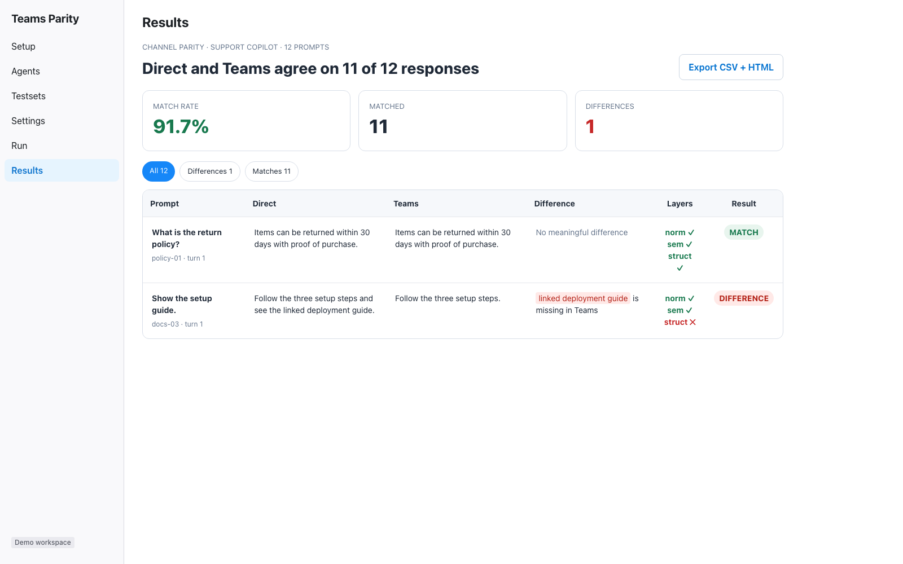
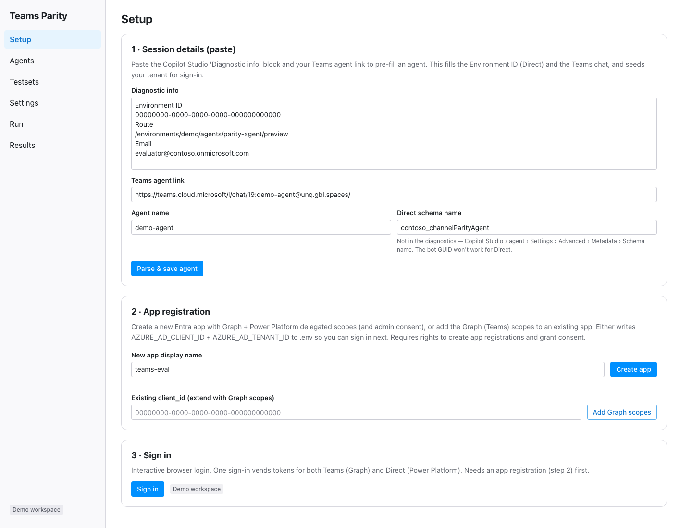
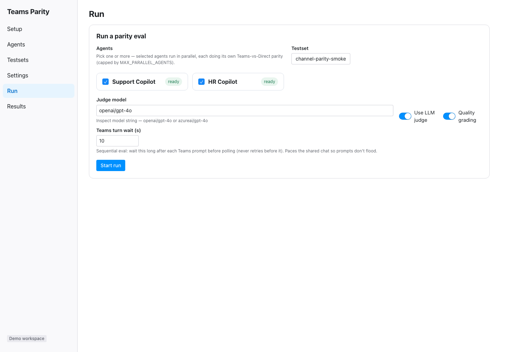
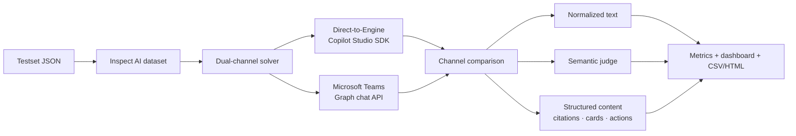
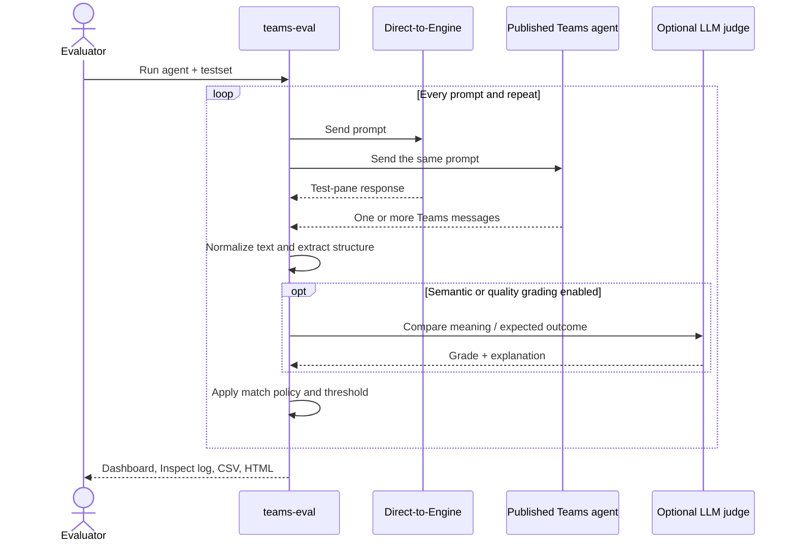
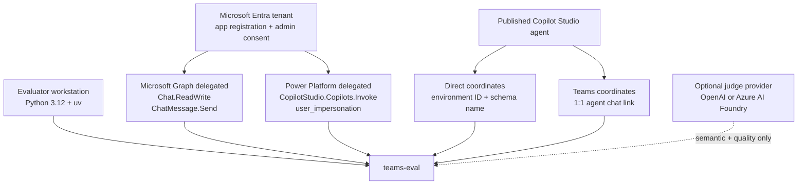

# teams-eval

**Catch Microsoft Copilot Studio regressions that only appear after publishing to Teams.**

[](https://www.python.org/)
[](https://inspect.aisi.org.uk/)
[](https://reflex.dev/)
[](LICENSE)

Run the **same testset** through the Copilot Studio test-pane engine and the **real published Teams
channel**. `teams-eval` pinpoints where answers diverge in wording, meaning, citations, adaptive
cards, or suggested actions — before users find the regression.

<p align="center">
  
</p>

> Built on [Inspect AI](https://inspect.aisi.org.uk/) with a CLI for automation and a Reflex web app
> for setup, execution, diagnosis, and export.

## The problem it solves

The Copilot Studio test pane is not the Teams runtime. Publishing can introduce different system
context, rendering, topic selection, message ordering, or structured content. An answer that looked
correct during authoring can arrive in Teams truncated, reformatted, missing a citation, or changed
entirely.

`teams-eval` turns that uncertainty into a repeatable release gate:

| Question | Evidence produced |
|---|---|
| Did Teams return the same answer as the test pane? | Normalized text, semantic, and structured-content comparison |
| Is a difference meaningful or only formatting? | Word-level diff plus an optional LLM judge explanation |
| Did Teams drop citations, cards, or suggested actions? | Independent structured-part checks |
| Is the agent stable across repeated runs? | Configurable repeats and agreement thresholds |
| Does the answer still satisfy the expected outcome? | Optional per-channel quality grading |
| Can I compare several agents before a rollout? | Parallel multi-agent runs with one combined dashboard |

Use it for pre-release validation, regression testing after topic or knowledge changes, Teams
deployment smoke tests, and evidence-backed conversations with makers or platform teams.

## What you get

- **Real dual-channel execution** — every prompt goes to Direct-to-Engine and the actual 1:1 Teams
  chat. Multi-message Teams replies are collected into one turn response.
- **Three independent comparison layers** — normalized text, semantic meaning, and HTML/structured
  content including citations, adaptive cards, and suggested actions.
- **Deterministic mode** — disable the LLM judge and run strict normalized-text parity checks with no
  OpenAI or Foundry key.
- **Non-determinism controls** — repeat cases and require a configurable agreement fraction instead
  of trusting a single run.
- **Actionable diagnostics** — inspect transcripts, filter differences, review word-level deltas,
  and export CSV plus standalone HTML reports.
- **One UI for the full workflow** — configure authentication, manage agents and testsets, launch
  runs, watch progress, and investigate results at `http://localhost:2009`.
- **Automation-ready CLI** — use the same evaluation engine locally or in a release workflow.
- **Operational safeguards** — sequential Teams pacing, Graph throttle handling, per-channel
  timeouts, cancellation, and a self-healing token cache.

## Product tour

### 1. Configure both channels

Paste Copilot Studio diagnostics and a Teams chat link, provision or extend the Entra app
registration, then sign in once for both Microsoft Graph and Power Platform.

<p align="center">
  
</p>

### 2. Run one testset against one or more agents

Choose the agents, testset, judge mode, and Teams pacing. Agents run in parallel while each Teams
conversation remains sequential to prevent response cross-talk.

<p align="center">
  
</p>

### 3. Investigate the exact difference

See Direct and Teams side by side, inspect the word-level delta, identify which comparison layer
failed, filter to regressions, and export the evidence.

<p align="center">
  
</p>

---

## How it works



A prompt and **all** the bot messages it produces are treated as **one turn / one response**.



### Comparison layers in detail

1. **Normalized text** — aggressive normalization, then exact equality. The cheapest, strictest layer.
2. **Semantic** — the judge model is asked whether the two answers convey the same meaning, ignoring
   formatting, greetings, and ordering. Returns a `C`/`I` grade with a short explanation.
3. **HTML / structured** — compares the HTML-derived body plus, individually, the set of **citations**
   (anchor hrefs), **adaptive cards** (flattened text leaves), and **suggested actions** (button
   titles). Parts absent in both responses are excluded from the decision.

`MATCH_POLICY` controls which layers must agree (default `normalized,semantic` = match if *either*
agrees). With **repeats > 1**, per-repeat matches are aggregated into an agreement fraction and
compared against the per-case `agreement_threshold` (default `DEFAULT_AGREEMENT_THRESHOLD`, `0.8`).

---

## Prerequisites



| Requirement | Why it is needed |
|---|---|
| **Python 3.12** and [uv](https://docs.astral.sh/uv/) | Run the evaluation engine, CLI, and Reflex app |
| **Microsoft Entra tenant** with app-registration and consent rights | Create delegated authentication for Graph and Power Platform |
| **Microsoft Graph delegated scopes** `Chat.ReadWrite`, `ChatMessage.Send` | Send prompts and read replies in the actual Teams chat |
| **Power Platform delegated scopes** `CopilotStudio.Copilots.Invoke` and `user_impersonation` | Invoke the same Copilot Studio agent through Direct-to-Engine |
| **Published Copilot Studio agent** | The target must be available through both Direct and Teams |
| **Environment ID + agent schema name** | Identify the Direct-to-Engine target; the bot GUID is not the schema name |
| **1:1 Teams agent chat link** | Identify the real published Teams conversation |
| **Optional OpenAI or Azure AI Foundry model** | Required only for semantic comparison and quality grading |

See **[SETUP.md](SETUP.md)** for the full app-registration walkthrough (automated and manual) and for
how to find the Teams chat ID.

---

## Quick start

```bash
uv sync                       # install dependencies into .venv
cp .env.example .env          # then fill in the values (see Configuration)
cp agents.example.json agents.json   # then register your agent(s)
```

**1. Provision the Entra app registration** (writes `AZURE_AD_TENANT_ID` / `AZURE_AD_CLIENT_ID` to
`.env`). Either create a new one or extend an existing app with the Teams (Graph) scopes:

```bash
uv run python setup_app.py create --name "teams-eval"
# or:
uv run python setup_app.py add-graph-scopes --client-id <existing-app-client-id>
```

**2. Register your agent(s)** in `agents.json` (copied from `agents.example.json` above) — each
agent's Direct coordinates and Teams chat link:

```json
{
  "my-agent": {
    "direct": { "environment_id": "<env-guid>", "agent_identifier": "<schema-name>" },
    "teams":  { "chat_link": "https://teams.cloud.microsoft/l/chat/19:...@unq.gbl.spaces/..." }
  }
}
```

**3. Sign in once** to prime both Microsoft Graph and Power Platform tokens:

```bash
uv run python auth.py
```

You can also do this from the **Sign in** step in the web app.

**4. Run a parity eval** (the `--model` is the **judge** for the semantic/quality layers):

```bash
uv run inspect eval channel_eval.py --model openai/gpt-4o \
    -T agent=my-agent -T testset=testsets/1-test.json

uv run inspect view                   # Inspect's results UI (transcripts, scores, filtering)
uv run python report.py --open        # purpose-built parity dashboard (CSV + HTML) in reports/
```

Tokens are cached locally and reused silently by subsequent runs.

### Deterministic run — no LLM judge, no key

Compare **normalized text only**, just to prove whether Teams and Direct differ:

```bash
uv run python eval_cli.py --agent my-agent --testset 1-test --no-llm-judge
```

The eval runs **one sample at a time** (the Teams chat is shared — parallel prompts flood it and get
mis-attributed). Pace each Teams turn with `--teams-wait` (seconds to wait after a prompt before
polling; defaults to `TEAMS_TURN_WAIT_S`, `10`):

```bash
uv run python eval_cli.py --agent my-agent --testset 1-test --teams-wait 15
```

---

## Web app (Reflex)

Everything above is also driveable from a single Reflex app — **setup, agents, testsets, settings,
running evals, and the parity dashboard** — on **`http://localhost:2009`**:

```bash
uv run reflex run                     # then open http://localhost:2009
```

Frontend runs on port **2009**, Reflex's internal backend on **2010**. The app reuses the same flat
modules as the CLIs, so both run side by side.

**Pages**

- **Setup** — three ordered steps: **(1) paste session details** — drop in the Copilot Studio
  *Diagnostic info* block + Teams agent link to auto-create an agent (Environment ID + Teams chat
  parsed for you; you add the Direct *schema name*, which diagnostics don't contain); **(2) app
  registration** — create the Entra app or add Graph (Teams) scopes to an existing one; **(3) sign
  in** — interactive browser login priming **both** audiences. Do steps 1–2 before signing in.
- **Agents** — add/edit/delete entries in `agents.json`; Teams chat links are parsed + validated.
- **Testsets** — create/edit `testsets/*.json` (per-case `id`, multi-turn `input`, `target`, `tags`,
  `repeats`, `agreement_threshold`). **Download** exports a testset as JSON; **Import** adds one
  (validated + name-sanitized).
- **Settings** — edit every `.env` knob (comparator toggles, match policy, repeats, Teams polling,
  turn wait, reset commands, judge model + Foundry/OpenAI endpoint & key).
- **Run** — pick one or more agents + a testset + judge + quality grading; runs in the background with
  live per-sample progress and a per-agent status badge. Selected agents run **in parallel** (capped by
  `MAX_PARALLEL_AGENTS`). **Cancel** aborts all in-flight runs. Turn **Use LLM judge** off for a fully
  deterministic, key-free run. Set **Teams turn wait (s)** per run.
- **Results** — the channel-difference dashboard (word-diff, per-layer badges, structured chips,
  All/Differences/Matches filter, CSV/HTML export) over any past run in `logs/`. A multi-agent run opens
  a **combined view** with an **agent** column and a per-agent matched/total summary.

---

## Results & reporting

- **`inspect view`** — Inspect AI's bundled viewer. Browse every sample, both channels' transcripts,
  scores, and filter pass/fail. The general-purpose results UI.
- **`report.py`** — a self-contained **channel-difference dashboard** (no extra deps). Each row shows
  Direct vs Teams side-by-side plus a **word-level diff** (red = only in Direct, green = only in
  Teams), per-layer agreement badges, and structured-part chips. `--open` opens it in your browser;
  output is also written as CSV.

```bash
uv run python report.py                       # latest log → reports/
uv run python report.py --log logs/<run>.eval --out-dir reports --open
```

---

## Configuration

| Where | What |
|-------|------|
| `agents.json` | Per-agent **Direct** (`environment_id`, `agent_identifier`) + **Teams** (`chat_link` or `chat_id`). Supports **multiple agents**. Git-ignored — see `agents.example.json`. |
| `.env` | Auth, polling, repeats/threshold, comparator toggles, match policy, judge model + key. See `.env.example`. |
| `testsets/*.json` | `cases[]` with `id`, `input`, optional `target`, `tags`, `repeats`, `agreement_threshold`. |

### Testset format

`input` is either a **string** (single turn) or a list of **turns** (`{"role": "user", "content": ...}`);
only user turns are sent. `target` (optional) is the criteria the quality grader checks against.

```json
{
  "name": "smoke",
  "cases": [
    {
      "id": "greeting",
      "input": "Hi, who are you and what can you do?",
      "target": "",
      "tags": ["smoke"],
      "repeats": 1,
      "agreement_threshold": 1.0
    }
  ]
}
```

### Key `.env` settings

| Variable | Default | Purpose |
|----------|---------|---------|
| `AZURE_AD_TENANT_ID` / `AZURE_AD_CLIENT_ID` | — | Entra app for interactive sign-in (set by `setup_app.py`). |
| `JUDGE_MODEL` | `openai/gpt-4o` | Inspect model string for semantic comparison + quality grading. |
| `OPENAI_API_KEY` / `AZUREAI_OPENAI_*` | — | Judge provider credentials (only for LLM layers). |
| `COMPARE_SEMANTIC` / `COMPARE_STRUCTURED` / `COMPARE_CITATIONS` / `COMPARE_CARDS` / `COMPARE_SUGGESTED` | `true` | Toggle each comparison layer/part. |
| `MATCH_POLICY` | `normalized,semantic` | Which layers must agree for a match. |
| `DEFAULT_REPEATS` / `DEFAULT_AGREEMENT_THRESHOLD` | `1` / `0.8` | Non-determinism handling. |
| `TEAMS_TURN_WAIT_S` | `10` | Wait after a Teams prompt before polling for the reply. |
| `TEAMS_POLL_INTERVAL_S` / `TEAMS_POLL_TIMEOUT_S` / `TEAMS_QUIET_WINDOW_S` / `TEAMS_RATE_DELAY_S` | `1.5` / `60` / `4` / `1.0` | Teams polling + throttle pacing. |
| `CHANNEL_TIMEOUT_S` | `90` | Hard per-channel timeout — a hung call is recorded as a channel error. |
| `TEAMS_RESET_COMMANDS` | — | Optional best-effort `/debug` reset commands sent before each sample. |
| `MAX_PARALLEL_AGENTS` | `3` | Cap on agents evaluated in parallel. |
| `LOG_LEVEL` / `LOG_FILE` | `INFO` / `logs/teams-eval.log` | Logging (rotating file sink). |

## Security and data handling

- Authentication uses **delegated user permissions**; the tool does not require a client secret.
- The token cache stays local and is excluded from Git.
- Real agent coordinates live in the Git-ignored `agents.json`; the repository only includes
  `agents.example.json`.
- `.env`, eval logs, generated reports, uploaded files, Reflex state, and local databases are all
  excluded from Git by default.
- Prompts and responses are sent only to the configured Microsoft channels and, when enabled, the
  configured judge provider.
- Deterministic mode keeps comparison local after the two channel responses are collected.

Review your organization's data-handling policy before sending production or sensitive prompts to an
external judge model.

---

## Project structure

```
teams-eval/
├── channel_eval.py      # Inspect task: dataset, dual_channel solver, channel_diff + quality scorers, metrics
├── compare.py           # ChannelResponse model, normalizers, the three comparators, judge helpers
├── direct_client.py     # Direct-to-Engine channel client (Copilot Studio SDK)
├── teams_client.py      # Teams channel client via Graph (send + poll + multi-message + /debug reset)
├── auth.py              # MSAL token provider — interactive login, cached, two audiences
├── setup_app.py         # Create/extend the Entra app registration (Graph + Power Platform scopes)
├── eval_cli.py          # Subprocess entry point for a single eval (used by the UI and for CLI runs)
├── report.py            # Visual channel-difference dashboard (word-level diff, filters) + CSV
├── log_setup.py         # Central loguru configuration
├── rxconfig.py          # Reflex config (ports 2009/2010, hot-reload excludes for logs/)
├── agents.json          # Per-agent Direct + Teams coordinates (git-ignored; see agents.example.json)
├── testsets/            # Testset JSON files
├── ui/                  # Reflex web app
│   ├── ui.py            # App entry — registers pages/routes
│   ├── pages/           # setup, agents, testsets, settings, run, results
│   ├── services/        # config_io, diagnostics, runner, logstream
│   └── components/      # layout + widgets
└── tests/               # Pytest suite
```

---

## Testing

```bash
uv run pytest             # run the suite
uv run ruff check .       # lint
uv run ruff format .      # format
```

---

## Tech stack

- **Python 3.12**, **uv**, **Ruff**, **Pytest**
- **[Inspect AI](https://inspect.aisi.org.uk/)** — evaluation framework (datasets, solvers, scorers,
  metrics, judge models, viewer)
- **microsoft-agents-copilotstudio-client** — Direct-to-Engine channel
- **MSAL** — delegated interactive auth (two audiences)
- **httpx** + **BeautifulSoup** — Graph calls + HTML extraction
- **Reflex** — the web app (pure-Python full-stack)
- **pydantic**, **loguru**, **typer**, **python-dotenv**, **openai**

---

## Troubleshooting

Common issues — full list in **[SETUP.md](SETUP.md#troubleshooting)**:

- **`Not signed in for audience=powerplatform` (or `=graph`)** — sign in again on Setup; it primes
  both audiences. Eval runs never open a browser themselves (they fail fast instead of hanging).
- **Run stuck on "Running…"** — click **Cancel**. Each channel call is also hard-capped by
  `CHANNEL_TIMEOUT_S`.
- **Every sample shows as a difference (match_rate 0)** — check both channels point at the **same
  agent**: Direct uses the schema `agent_identifier`, Teams uses the chat link. An empty Copilot
  Studio agent answers Direct with *"Sorry, I am not able to find a related topic."*
- **`Direct start_conversation returned no conversation id`** — handled automatically (the client
  falls back to the `x-ms-conversationid` header). If it persists, verify the `environment_id` and
  schema `agent_identifier`.
- **Teams chat flooded / answers mismatched** — the eval runs one sample at a time and waits
  `TEAMS_TURN_WAIT_S` after each prompt. Increase the wait for slow agents.

---

## License

Released under the [MIT License](LICENSE).
